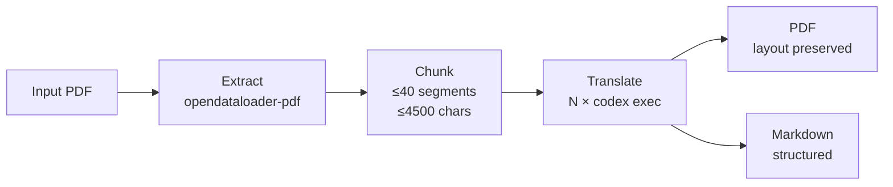

# PDF Translator

PDF 문서를 추출하고 Codex CLI로 병렬 번역하여, 원본 레이아웃을 유지한 PDF와 Markdown을 생성하는 CLI 도구.

## Architecture



## Requirements

- Python 3.10+
- Java 11+ (opendataloader-pdf dependency)
- [Codex CLI](https://github.com/openai/codex) installed and authenticated

### macOS

```bash
# Java
brew install openjdk@21
echo 'export PATH="/opt/homebrew/opt/openjdk@21/bin:$PATH"' >> ~/.zshrc
source ~/.zshrc

# Codex CLI
npm install -g @anthropic-ai/codex
```

### Ubuntu/Debian

```bash
# Java
sudo apt install openjdk-21-jdk

# Codex CLI
npm install -g @anthropic-ai/codex
```

## Installation

```bash
git clone https://github.com/babyworm/pdf-translator.git
cd pdf-translator
python -m venv .venv
source .venv/bin/activate
pip install -e .
```

### Verify installation

```bash
# Check all dependencies
java -version          # Java 11+ required
codex --version        # Codex CLI required
pdf-translator --help  # Should show usage
```

## Usage

```bash
pdf-translator input.pdf [options]
```

### Options

| Option | Default | Description |
|--------|---------|-------------|
| `--output-dir` | `./output` | Output directory |
| `--workers` | `4` | Number of parallel translation processes |
| `--source-lang` | `en` | Source language code |
| `--target-lang` | `ko` | Target language code |
| `--effort` | `low` | Codex reasoning effort (`low`/`medium`/`high`) |
| `--pages` | all | Pages to process (e.g., `1,3,5-7`) |
| `--no-cache` | false | Disable SQLite translation cache |

### Supported languages

`en` (English), `ko` (Korean), `ja` (Japanese), `zh` (Chinese), `de` (German), `fr` (French), `es` (Spanish), `pt` (Portuguese), `it` (Italian)

### Examples

```bash
# Basic: translate English PDF to Korean
pdf-translator paper.pdf

# Translate with 8 parallel workers
pdf-translator paper.pdf --workers 8

# Translate specific pages from Japanese to English
pdf-translator document.pdf --source-lang ja --target-lang en --pages 1-10

# High-effort translation (slower, better quality)
pdf-translator report.pdf --effort high

# Translate without caching
pdf-translator report.pdf --no-cache

# Custom output directory
pdf-translator thesis.pdf --output-dir ./translated
```

## Output

```
output/
├── input_translated.pdf    # Layout-preserved translated PDF
├── input_translated.md     # Structured Markdown translation
└── cache.db                # Translation cache (SQLite, reusable)
```

### Translation cache

Translations are cached in SQLite (`cache.db`) keyed by SHA-256 hash + language pair. Re-running the same document skips already-translated segments. Delete `cache.db` or use `--no-cache` to force re-translation.

## How It Works

1. **Extract** — `opendataloader-pdf` parses PDF into structured JSON with bounding boxes, fonts, and element types
2. **Chunk** — Elements are grouped into batches (≤40 segments, ≤4500 chars) for optimal translation
3. **Translate** — `multiprocessing.Pool` dispatches batches to `codex exec` in parallel, with SQLite caching and exponential backoff retry
4. **Rebuild PDF** — PyMuPDF overlays translated text onto the original PDF at exact bounding box positions with CJK font support
5. **Generate Markdown** — Structural elements (headings, paragraphs, tables, lists) are converted to GFM Markdown

## Development

### Run tests

```bash
source .venv/bin/activate
python -m pytest tests/ -v
```

### Project structure

```
pdf_translator/
├── cli.py           # CLI entry point + pipeline orchestration
├── config.py        # TranslatorConfig dataclass
├── extractor.py     # opendataloader-pdf wrapper → Element list
├── chunker.py       # Dual-constraint batch builder
├── translator.py    # Codex CLI parallel translation
├── cache.py         # SQLite translation cache
├── pdf_builder.py   # PyMuPDF layout-preserving overlay
└── md_builder.py    # GFM Markdown generator
```

## License

[MIT](LICENSE)
