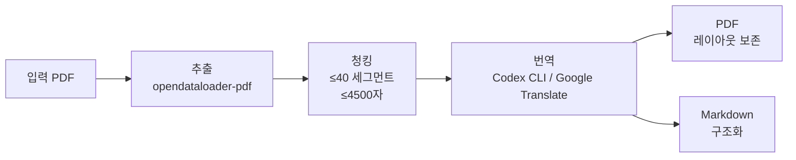

# PDF Translator

PDF 문서를 추출하고 병렬 번역하여, 원본 레이아웃을 유지한 PDF와 Markdown을 생성하는 CLI 도구.

## 아키텍처



## 요구사항

- Python 3.10+
- Java 11+ (opendataloader-pdf 의존성)
- [Codex CLI](https://github.com/openai/codex) (선택 — 미설치 시 Google Translate로 자동 전환)

### macOS

```bash
# Java
brew install openjdk@21
echo 'export PATH="/opt/homebrew/opt/openjdk@21/bin:$PATH"' >> ~/.zshrc
source ~/.zshrc

# Codex CLI (선택)
npm install -g @anthropic-ai/codex
```

### Ubuntu/Debian

```bash
# Java
sudo apt install openjdk-21-jdk

# Codex CLI (선택)
npm install -g @anthropic-ai/codex
```

## 설치

```bash
git clone https://github.com/babyworm/pdf-translator.git
cd pdf-translator
python -m venv .venv
source .venv/bin/activate
pip install -e .
```

### 설치 확인

```bash
java -version          # Java 11+ 필요
pdf-translator --help  # 사용법 출력 확인
```

## 사용법

```bash
pdf-translator input.pdf [옵션]
```

### 옵션

| 옵션 | 기본값 | 설명 |
|------|--------|------|
| `--output-dir` | `./output` | 출력 디렉토리 |
| `--workers` | CPU 코어 수 (최대 8) | 병렬 번역 프로세스 수 |
| `--source-lang` | `auto` | 원본 언어 코드 (`auto`: 자동 감지) |
| `--target-lang` | `ko` | 번역 대상 언어 코드 |
| `--effort` | `low` | Codex 추론 노력도 (`low`/`medium`/`high`, Codex 전용) |
| `--pages` | 전체 | 처리할 페이지 (예: `1,3,5-7`) |
| `--no-cache` | false | SQLite 번역 캐시 비활성화 |

### 지원 언어

`en` (영어), `ko` (한국어), `ja` (일본어), `zh` (중국어), `de` (독일어), `fr` (프랑스어), `es` (스페인어), `pt` (포르투갈어), `it` (이탈리아어)

### 예시

```bash
# 기본: 영어 PDF를 한국어로 번역
pdf-translator paper.pdf

# 8개 워커로 병렬 번역
pdf-translator paper.pdf --workers 8

# 일본어 PDF를 영어로, 특정 페이지만
pdf-translator document.pdf --source-lang ja --target-lang en --pages 1-10

# 높은 품질 번역 (Codex 전용, 느리지만 정확)
pdf-translator report.pdf --effort high

# 캐시 없이 번역
pdf-translator report.pdf --no-cache

# 출력 디렉토리 지정
pdf-translator thesis.pdf --output-dir ./translated
```

## 출력

```
output/
├── input_translated.pdf    # 레이아웃 보존 번역 PDF
├── input_translated.md     # 구조화된 Markdown 번역
└── cache.db                # 번역 캐시 (SQLite, 재사용 가능)
```

### 번역 캐시

번역 결과는 SQLite(`cache.db`)에 SHA-256 해시 + 언어 쌍 기준으로 캐싱됩니다. 동일 문서 재실행 시 이미 번역된 세그먼트는 건너뜁니다. `cache.db`를 삭제하거나 `--no-cache` 옵션으로 재번역을 강제할 수 있습니다.

## 동작 원리

1. **추출** — `opendataloader-pdf`가 PDF를 바운딩 박스, 폰트, 요소 타입이 포함된 구조화 JSON으로 파싱
2. **청킹** — 요소를 배치로 그룹화 (≤40 세그먼트, ≤4500자) 하여 최적 번역 단위 생성
3. **언어 감지** — `--source-lang auto` 시 `langdetect`로 원본 언어 자동 판별
4. **번역** — `multiprocessing.Pool`이 배치를 병렬 번역 (Codex CLI 우선, 미설치 시 Google Translate 폴백). SQLite 캐싱 및 지수 백오프 재시도 적용
5. **PDF 재구성** — PyMuPDF가 원본 PDF의 정확한 바운딩 박스 위치에 번역 텍스트를 오버레이 (CJK 폰트 지원)
6. **Markdown 생성** — 구조적 요소(제목, 문단, 표, 목록)를 GFM Markdown으로 변환

## 개발

### 테스트 실행

```bash
source .venv/bin/activate
python -m pytest tests/ -v
```

### 프로젝트 구조

```
pdf_translator/
├── cli.py           # CLI 진입점 및 파이프라인 오케스트레이션
├── config.py        # TranslatorConfig 데이터클래스
├── extractor.py     # opendataloader-pdf 래퍼 → Element 리스트
├── chunker.py       # 이중 제약 배치 빌더
├── translator.py    # 병렬 번역 (Codex CLI / Google Translate 폴백)
├── cache.py         # SQLite 번역 캐시
├── pdf_builder.py   # PyMuPDF 레이아웃 보존 오버레이
└── md_builder.py    # GFM Markdown 생성기
```

## 라이선스

[MIT](LICENSE)
