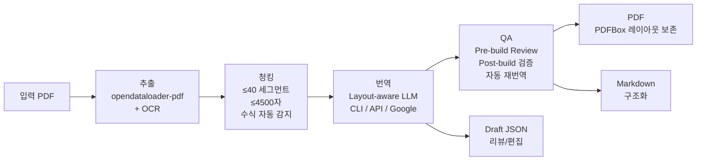

# PDF Translator

PDF 문서를 추출하고 병렬 번역하여, 원본 레이아웃을 유지한 PDF와 Markdown을 생성하는 CLI 도구 + 웹 UI.

## 아키텍처



## 주요 기능

- **다중 백엔드**: Codex CLI, Claude CLI, Gemini CLI (무료) + OpenAI, Anthropic, Google, OpenRouter API
- **자동 백엔드 선택**: CLI 우선 → API 폴백 → Google Translate 최종 폴백
- **레이아웃 보존**: Apache PDFBox (Java) 기반 PDF 빌드. 원본 텍스트 위치에 번역 오버레이. pypdf+reportlab 폴백
- **Layout-aware 번역**: bbox 크기를 LLM에 전달하여 공간 인식 번역. 수식/변수 자동 skip
- **QA 파이프라인**: Pre-build 이상 감지 + Post-build 텍스트 검증 + 자동 재번역 (최대 N회)
- **수식 보존**: strong/weak 기호 분류로 수식 자동 감지. 번역하지 않고 원본 유지
- **용어집**: 3단 구조 (내장 팩 + keep-as-is 규칙 + 사용자 용어집). 과번역/과소번역 방지
- **OCR**: Surya (ML 기반, 기본) + Tesseract (경량 폴백). 스캔 PDF 자동 감지
- **Draft 모드**: JSON 중간 결과 저장 → 수정 → 재빌드. 번역 리뷰 워크플로우
- **웹 UI**: Side-by-side 비교, 인라인 편집, 용어집 관리, 실시간 진행률

## 요구사항

- Python 3.10+
- Java 11+ (opendataloader-pdf + PDFBox PDF 빌더)

## 설치

### 원라인 설치 (권장)

```bash
curl -fsSL https://raw.githubusercontent.com/babyworm/pdf-translator/main/scripts/install.sh | bash
```

시스템 의존성(Java, 선택적 Tesseract)을 자동으로 설치합니다. macOS, Ubuntu, Fedora 지원.

CI 환경: `curl ... | bash -s -- --no-interactive`

### pip 설치

```bash
git clone https://github.com/babyworm/pdf-translator.git
cd pdf-translator
python -m venv .venv
source .venv/bin/activate

# 기본 (CLI + Google Translate)
pip install -e .

# OCR 지원 추가
pip install -e ".[ocr]"

# 웹 UI 추가
pip install -e ".[web]"

# 전체 설치
pip install -e ".[all]"
```

> **참고**: Java 11+가 필요합니다. `brew install openjdk@21` (macOS) 또는 `sudo apt install default-jdk` (Ubuntu)

### Docker

```bash
# 웹 서버 모드
docker compose up

# CLI 모드 (현재 디렉토리의 PDF를 번역)
docker run -v $(pwd):/data ghcr.io/babyworm/pdf-translator /data/input.pdf

# docker compose CLI 프로필
docker compose run --rm cli input.pdf --target-lang ko
```

### Homebrew (macOS)

```bash
brew tap babyworm/tap
brew install pdf-translator
```

## CLI 사용법

```bash
pdf-translator input.pdf [옵션]
```

### 옵션

| 옵션 | 기본값 | 설명 |
|------|--------|------|
| `--output-dir` | `./output` | 출력 디렉토리 |
| `--workers` | CPU 코어 수 (최대 8) | 병렬 번역 프로세스 수 |
| `--source-lang` | `auto` | 원본 언어 코드 (`auto`: 자동 감지) |
| `--target-lang` | `ko` | 번역 대상 언어 코드 |
| `--backend` | `auto` | 번역 백엔드 (아래 표 참조) |
| `--effort` | `low` | Codex 추론 노력도 (`low`/`medium`/`high`) |
| `--glossary` | - | 용어집 CSV 경로 또는 내장 팩 이름 |
| `--pages` | 전체 | 처리할 페이지 (예: `1,3,5-7`) |
| `--no-cache` | false | SQLite 번역 캐시 비활성화 |
| `--no-qa` | false | QA 리뷰 비활성화 |
| `--qa-retries` | `2` | QA 자동 재번역 최대 횟수 |
| `--draft-only` | false | Draft JSON만 저장, PDF 빌드 생략 |
| `--build-from` | - | Draft JSON에서 PDF/MD 빌드 |
| `--retranslate` | - | Draft의 미완료 항목 재번역 |
| `--ocr-engine` | `auto` | OCR 엔진 (`auto`/`surya`/`tesseract`/`none`) |

### 번역 백엔드

| 백엔드 | `--backend` 값 | 타입 | 비용 |
|--------|----------------|------|------|
| Codex CLI | `codex` | CLI | 무료 |
| Claude CLI | `claude-cli` | CLI | 무료 |
| Gemini CLI | `gemini-cli` | CLI | 무료 |
| OpenRouter | `openrouter` | API | 유료 (`OPENROUTER_API_KEY`) |
| OpenAI | `openai-api` | API | 유료 (`OPENAI_API_KEY`) |
| Anthropic | `anthropic-api` | API | 유료 (`ANTHROPIC_API_KEY`) |
| Google Gemini | `google-api` | API | 유료 (`GOOGLE_API_KEY`) |
| Google Translate | `google-translate` | API | 무료 |
| 자동 선택 | `auto` (기본) | - | CLI 우선 → API → Google Translate |

### 예시

```bash
# 기본: 자동 백엔드로 영어 PDF를 한국어로 번역 (QA 포함)
pdf-translator paper.pdf

# Claude CLI + ML 용어집
pdf-translator paper.pdf --backend claude-cli --glossary ml-ai

# OpenAI API, 특정 페이지만
pdf-translator document.pdf --backend openai-api --pages 1-10

# QA 없이 빠르게 번역
pdf-translator paper.pdf --no-qa

# QA 재시도 3회
pdf-translator paper.pdf --qa-retries 3

# Draft만 저장 (리뷰용)
pdf-translator paper.pdf --draft-only --glossary terms.csv

# Draft에서 PDF 빌드
pdf-translator --build-from output/paper_draft.json

# 미완료 항목만 다른 백엔드로 재번역
pdf-translator --retranslate output/paper_draft.json --backend openai-api

# 스캔 PDF + Tesseract OCR
pdf-translator scanned.pdf --ocr-engine tesseract

# 의존성 확인
pdf-translator check-deps
```

## QA 파이프라인

기본적으로 QA가 활성화되어 번역 품질을 자동으로 검증합니다.

```
번역 → Pre-build Review → PDF 빌드 → Post-build QA → (문제 시 자동 재번역)
```

### Pre-build Review
- 번역이 비었거나 원본과 동일한 경우 감지
- bbox 대비 번역 텍스트 오버플로 예측
- 이상 항목만 LLM에 전송하여 수정/유지/건너뛰기 판단

### Post-build QA
- 빌드된 PDF에서 텍스트를 재추출하여 원본과 비교
- 누락된 세그먼트, 원본 텍스트 잔존 감지
- 문제 페이지만 LLM에 전송하여 재번역 대상 결정

### 자동 재번역
- 문제가 있는 세그먼트만 선별적으로 재번역 (전체 재번역 아님)
- `--qa-retries N`으로 최대 반복 횟수 제어 (기본 2)
- `--no-qa`로 비활성화 가능

## 용어집

### 내장 용어집 팩

| 팩 이름 | 내용 |
|---------|------|
| `cs-general` | CS 일반 용어 (API, GPU, SDK 등 28개 keep 규칙) |
| `ml-ai` | ML/AI 용어 (BERT, transformer, attention 등 41개 keep+translate 혼합) |

```bash
pdf-translator paper.pdf --glossary cs-general
pdf-translator paper.pdf --glossary ml-ai
```

### 사용자 용어집 (CSV)

```csv
source,target,rule
API,API,keep
transformer,트랜스포머,translate
fine-tuning,파인튜닝,translate
```

`rule` 컬럼은 선택적입니다. `keep`은 번역하지 않을 용어, `translate`는 지정된 번역을 사용합니다.

## 웹 UI

```bash
pip install -e ".[web]"
pdf-translator serve --port 8000
# http://localhost:8000 에서 접속
```

### 기능
- PDF 업로드 → 번역 시작
- Side-by-side 원본/번역 비교
- 세그먼트 클릭하여 인라인 편집
- 용어집 관리 (추가/수정, CSV 임포트)
- 번역 상태 (승인/수정/대기) 추적
- PDF/Markdown 내보내기

## Python API

```python
from pdf_translator.core import translate_pdf

result = translate_pdf(
    "paper.pdf",
    target_lang="ko",
    backend="auto",
    glossary="ml-ai",
)

print(result["pdf_path"])   # 번역된 PDF 경로
print(result["md_path"])    # 번역된 Markdown 경로
```

### 세부 제어

```python
from pdf_translator.core.extractor import extract_pdf
from pdf_translator.core.translator.router import BackendRouter

elements = extract_pdf("paper.pdf")
router = BackendRouter()
backend = router.select("claude-cli")
translations = backend.translate(
    [el.content for el in elements],
    source_lang="en", target_lang="ko",
)
```

## 출력

```
output/
├── input_translated.pdf    # 레이아웃 보존 번역 PDF
├── input_translated.md     # 구조화된 Markdown 번역
├── input_draft.json        # Draft (--draft-only 시)
└── cache.db                # 번역 캐시 (SQLite)
```

## 프로젝트 구조

```
pdf_translator/
├── core/                   # 순수 라이브러리 (비즈니스 로직)
│   ├── __init__.py         # translate_pdf() 공개 API
│   ├── extractor.py        # opendataloader-pdf 래퍼 + Java 체크
│   ├── chunker.py          # 배치 빌더 + 수식 감지 (is_math)
│   ├── cache.py            # SQLite 번역 캐시
│   ├── config.py           # TranslatorConfig
│   ├── glossary.py         # 용어집 (3단 구조)
│   ├── draft.py            # Draft JSON 관리
│   ├── qa.py               # QA 파이프라인 (pre/post-build)
│   ├── pdf_builder.py      # PDF 빌드 (PDFBox primary + reportlab fallback)
│   ├── md_builder.py       # GFM Markdown 생성
│   └── translator/         # 번역 엔진
│       ├── base.py         # Protocol + 프롬프트 빌더 + QA 프롬프트
│       ├── router.py       # 백엔드 자동 선택
│       └── backends/       # 백엔드 구현체 (8개)
├── java/                   # Java PDF 빌더 (Apache PDFBox)
│   └── PdfBuilder.java     # 자동 컴파일, subprocess 호출
├── ocr/                    # OCR 파이프라인
│   ├── base.py             # OCREngine Protocol
│   ├── detector.py         # 스캔 PDF 자동 감지 (pypdf)
│   ├── surya_engine.py     # Surya (ML 기반)
│   └── tesseract_engine.py # Tesseract (경량)
├── cli/                    # CLI 진입점
│   └── main.py
├── web/                    # 웹 애플리케이션
│   ├── app.py              # FastAPI 서버 (lifespan 핸들러)
│   ├── models.py           # SQLite 모델
│   └── frontend/           # React + TypeScript SPA
└── data/
    └── glossaries/         # 내장 용어집 CSV
```

## 개발

```bash
source .venv/bin/activate
python -m pytest tests/ -v
```

## 라이선스

[MIT](LICENSE) — 모든 core 의존성은 permissive 라이선스 (MIT/BSD/Apache).

자세한 내용은 [THIRD_PARTY_LICENSES.md](THIRD_PARTY_LICENSES.md)를 참조하세요.
